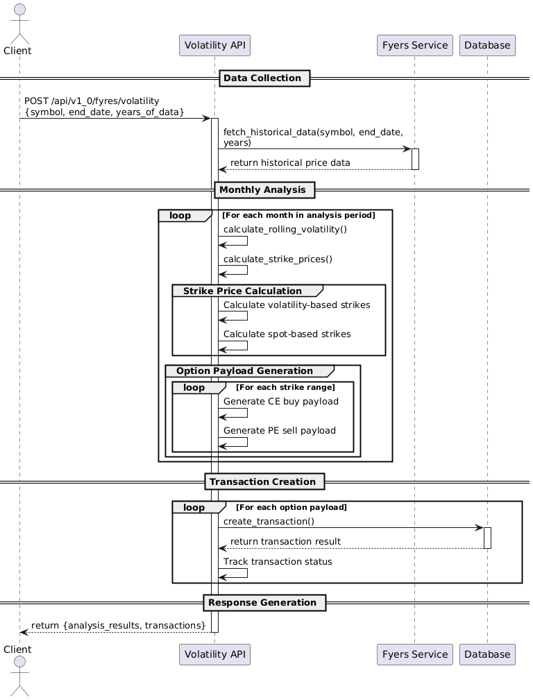

# API Documentation

## Overview
This document provides detailed information about the API endpoints available in the NSE module of the application.

## Base URL  for the API
- The base URL for the API is determined by the environment variable `NSE_SERVICE_URL`.

## Authentication
- No authentication is required for the endpoints in this module.

## Endpoints

### 1. Search Data
- **Endpoint**: `/api/v1_0/search-data/{from_date}/{to_date}/{instrument_type}/{symbol}/{year}/{expiry_date}/{option_type}/{strike_price}`
- **Method**: `GET`
- **Description**: Searches for data dynamically. Checks if data exists in the database. If not found, fetches from NSE.

#### Path Parameters
| Parameter        | Type   | Required | Description                                      |
|------------------|--------|----------|--------------------------------------------------|
| `from_date`      | string | Yes      | Start date in `DD-MM-YYYY` format.              |
| `to_date`        | string | Yes      | End date in `DD-MM-YYYY` format.                |
| `instrument_type`| string | Yes      | Type of instrument (e.g., `OPTIDX`).            |
| `symbol`         | string | Yes      | Symbol name (e.g., `NIFTY`, `BANKNIFTY`).      |
| `year`           | int    | Yes      | Year of the data.                               |
| `expiry_date`    | string | Yes      | Expiry date in `DD-MMM-YYYY` format.            |
| `option_type`    | string | Yes      | Option type (e.g., `CE` for Call, `PE` for Put).|
| `strike_price`    | int    | Yes      | Strike price of the option.                      |

#### Responses
- **Status Code**: `200 OK`
- **Response Body**:
```json
{
  "status": "success",
  "source": "database/{table_name} | nse | combined",
  "data": [...]
}
```

- **Error Responses**:
  - **400 Bad Request**: If any of the parameters are invalid.
  - **404 Not Found**: If no data is found in the database or NSE.
  - **500 Internal Server Error**: If there is an unexpected error.


### 3. User Registration
- **Endpoint**: `/api/v1_0/register_user`
- **Method**: `POST`
- **Description**: Register a new user.

#### Request Body
```json
{
  "username": "string",
  "password": "string",
  "email": "string",
  "full_name": "string"
}
```

**Parameters**:

| Parameter  | Type   | Required | Description                          |
| ---------- | ------ | -------- | ------------------------------------ |
| `username` | string | Yes      | Unique username for the user.        |
| `password` | string | Yes      | Password for the user.               |
| `email`    | string | Yes      | Email address of the user.           |
| `full_name`| string | Yes      | Full name of the user.               |

#### Responses
- **Status Code**: `200 OK`
- **Response Body**:
```json
 "Status": "success",
  "data": {
    "user_id": 123,
    "username": "string"
  }
```
- **Error Responses**:
  - **400 Bad Request**: If any of the parameters are invalid.
       - ```json
          {
            "status": "error",
            "message": "Username already exists"
          }
          ```
  - **500 Internal Server Error**: If there is an unexpected error.
       - ```json
          {
            "status": "error",
            "message": "Internal Server Error"
          }
          ```


### 4. User Login
- **Endpoint**: `/api/v1_0/login`
- **Method**: `POST`
- **Description**: Authenticate a user.

#### Request Body
```json
{
  "username": "string",
  "password": "string"
}
```

- **Parameters**:
  | Parameter | Type   | Required | Description                          |
  | --------- | ------ | -------- | ------------------------------------ |
  | `username`| string | Yes      | Username of the user.                |
  | `password`| string | Yes      | Password of the user.                |

#### Responses
- **Status Code**: `200 OK`
- **Response Body**:
```json
{
  "status": "success",
  "access_token": "string",
  "data": {
    "user_id": 123,
    "username": "string",
    "user_type": "string"
  }
}
```
- **Error Responses**:
  - **400 Bad Request**: If the user does not exist
       - ```json
          {
            "status": "error",
            "message": "user not found with this username"
          }
          ```
  - **401 Unauthorized**: If the username or password is incorrect.
       - ```json
          {
            "status": "error",
            "message": "Invalid username or password"
          }
          ```
  - **500 Internal Server Error**: If there is an unexpected error.
       - ```json
          {
            "status": "error",
            "message": "Internal Server Error"
          }
          ```

### 5. Create Transection
- **Endpoint** : `/api/v1_0/create_transection`  
- **Method** : `POST`  
- **Description** : Create a new transaction for authenticated user.

- **Headers** :  
```json
{
  "Authorization": "Bearer <access_token>"
}
```

- **Request Body** :  
```json
{
  "symbol": "string",
  "instrument": "string",
  "strike_price": 0,
  "option_type": "string",
  "lots": 0,
  "trade_date": "YYYY-MM-DD",
  "expiry_date": "YYYY-MM-DD"
}

```
- **Response** :
  - **201 Created**: If the transaction is created successfully.
       - ```json
          {
            "status": "success",
            "transaction_id": 123,
            "entry_price": 0.0
          }

          ```
  - **400 Bad Request**: If the  request-user-id header is missing .
       - ```json
          {
            "status": "error",
            "message": "Invalid request body"
          }
          ```
  - **401 Unauthorized**: If the access token is invalid or expired.
       - ```json
          {
            "status": "error",
            "message": "Invalid or expired access token"
          }
          ```


### 6. Strategy Simulation
- **Endpoint** : `/api/v1_0/strategy/simulation`
- **Method** : `GET`
- **Description** : Simulates trading strategy performance based on user's active positions, calculating both realized and unrealized PnL over time.

- **Request** :
  - **Headers** :
    - `Authorization`: Bearer <access_token>
    - `request-user-id`: <user_id>
  
- **Response** :
  - **200 OK**: If the simulation is successful.
       - ```json
                    {
            "status": "success",
            "data": [
              {
                "date": "DD-MMM-YYYY",
                "unrealised": [
                  {
                    "contract": ["SYMBOL", "OPTION_TYPE", "STRIKE_PRICE", "EXPIRY_DATE", "POSITION_TYPE"],
                    "lots": 0,
                    "daily_action": "NEW_LONG|NEW_SHORT|ADDED_TO_LONG|ADDED_TO_SHORT|REDUCED_LONG|REDUCED_SHORT|CLOSED_LONG|CLOSED_SHORT|FLIPPED_TO_LONG|FLIPPED_TO_SHORT|EXPIRED|NO_CHANGE",
                    "debug_info": {
                      "entry_price": 0.0,
                      "closing_price": 0.0,
                      "market_lot": 0,
                      "pnl_calculation": "string"
                    },
                    "pnl": 0.0
                  }
                ],
                "realised": [
                  {
                    "contract": ["SYMBOL", "OPTION_TYPE", "STRIKE_PRICE", "EXPIRY_DATE", "CLOSED_LONG|CLOSED_SHORT"],
                    "lots": 0,
                    "pnl": 0.0,
                    "debug_info": {
                      "entry_price_closed": 0.0,
                      "exit_price": 0.0,
                      "market_lot": 0,
                      "pnl_calculation": "string"
                    }
                  }
                ],
                "total_unrealised_pnl": 0.0,
                "total_realized_pnl": 0.0,
                "cumulative_total_realized_pnl": 0.0
              }
            ]
          }

- **Error Response:**
  - **400 Bad Request:** If the request-user-id header is missing
      - ```json
          {
            "detail": "request-user-id header is required"
          }
          ```
      - **404 Not Found:** If the user has no active positions
      - ```json
          {
            "detail": "No active positions found"
          }
          ```
      - **500 Internal Server Error:** If there is an error in the server
          - ```json
              {
                "detail": "Internal server error"
              }
              ```

### 7. Get Fyers Access Token
- **Endpoint**: `/api/v1_0/fyres/access_token`
- **Method**: `GET`
- **Description**: Retrieves an access token from Fyers trading platform.

#### Parameters
- No parameters required

#### Responses
- **Status Code**: `200 OK`
- **Response Body**:
```json
{
    "access_token": "string"
}
```

- **Error Responses**:
  - **500 Internal Server Error**: If there is an error getting the access token
    ```json
    {
        "error": "Error in getting access token"
    }
    ```


### 8. Calculate Volatility
- **Endpoint**: `/api/v1_0/fyres/volatility`
- **Method**: `POST`
- **Description**: Calculates historical volatility, generates strike prices, and creates option transactions based on volatility analysis.

#### Request Body
```json
{
    "symbol": "NSE:NIFTY50-INDEX",
    "end_date": "2025-04-30",
    "years_of_data": 2,
    "custom_multiplier": false,
    "multipliers": [1.5]
}
```

| Field              | Type    | Required | Description                                           |
|-------------------|---------|----------|-------------------------------------------------------|
| symbol            | string  | Yes      | Trading symbol (e.g., "NSE:NIFTY50-INDEX")           |
| end_date          | string  | Yes      | End date for analysis (YYYY-MM-DD)                   |
| years_of_data     | integer | Yes      | Number of years of historical data to analyze        |
| custom_multiplier | boolean | No       | Enable custom volatility multipliers (default: false) |
| multipliers       | array   | No       | Custom multipliers for volatility calculation        |

#### Headers
| Name            | Required | Description        |
|-----------------|----------|--------------------|
| request_user_id | Yes      | User identifier    |

#### Response
```json
{
    "symbol": "NSE:NIFTY50-INDEX",
    "analysis_period": {
        "start": "2024-04-30",
        "end": "2025-04-29"
    },
    "monthly_analysis": [
        {
            "date": "2024-05-01",
            "volatility_metrics": {
                "daily_volatility": 0.85,
                "monthly_volatility": 4.2,
                "spot": 22345.6
            },
            "strike_ranges": {
                "range_1.5sd": {
                    "lower_strike": 21800,
                    "upper_strike": 22900
                }
            },
            "spot_based_strikes": {
                "spot": 22345.6,
                "lower_strike": 22200,
                "upper_strike": 22400
            }
        }
    ],
    "option_transactions": [...],
    "transactions_created": [...]
}
```

#### Error Responses
- **404 Not Found**: When no historical data is found
```json
{
    "error": "No data found for the given symbol and date range"
}
```
- **500 Internal Server Error**: For processing errors
```json
{
    "error": "Error message details"
}
```
#### Sequence Diagram


*Figure 1: Sequence diagram showing the workflow of the volatility calculation API*


### Workflow Description
1. **Data Collection**:
   - Receives request with symbol and date parameters
   - Fetches historical data from Fyers
   - Validates data availability

2. **Volatility Analysis**:
   - Performs monthly rolling volatility calculations
   - Calculates multiple strike ranges based on volatility
   - Generates spot-based strike prices

3. **Transaction Creation**:
   - Creates option transactions for each strike
   - Handles both CE (Call) and PE (Put) options
   - Tracks transaction status

4. **Response Generation**:
   - Returns complete analysis with all calculations
   - Includes transaction status for each option
   - Provides comprehensive monthly breakdown


# Adding Documentation for the Numerical Strategy Analysis API

Let me create comprehensive documentation for your new `analyze_custom_strategy` API endpoint to add to your API_Documentation.md file:

```markdown
### 9. Analyze Custom Strategy
- **Endpoint**: `/api/v1_0/analyze_custom_strategy`
- **Method**: `POST`
- **Description**: Analyzes any options strategy using numerical methods, automatically fetching current premiums if not provided. Works for both standard recognized strategies and custom complex multi-leg strategies.

#### Request Body
```json
{
  "legs": [
    {
      "symbol": "NIFTY",
      "expiry": "10-Jul-2025",
      "strike": 25500,
      "option_type": "CE",
      "action": "BUY",
      "premium": 100.1,  // Optional - will be fetched automatically if not provided
      "quantity": 75
    },
    {
      "symbol": "NIFTY",
      "expiry": "10-Jul-2025",
      "strike": 25600,
      "option_type": "CE",
      "action": "SELL",
      "premium": 61.9,   // Optional - will be fetched automatically if not provided
      "quantity": 75
    }
  ]
}
```

**Parameters**:

| Parameter | Type | Required | Description |
|-----------|------|----------|-------------|
| `legs` | array | Yes | Array of option legs that make up the strategy |
| `legs[].symbol` | string | Yes | Symbol of the underlying (e.g., "NIFTY", "BANKNIFTY") |
| `legs[].expiry` | string | Yes | Expiry date in "DD-MMM-YYYY" format |
| `legs[].strike` | number | Yes | Strike price of the option |
| `legs[].option_type` | string | Yes | Option type ("CE" for Call, "PE" for Put) |
| `legs[].action` | string | Yes | Action ("BUY" or "SELL") |
| `legs[].premium` | number | No | Premium of the option. If not provided, will be fetched from NSE |
| `legs[].quantity` | number | Yes | Number of contracts |

#### Responses
- **Status Code**: `200 OK`
- **Response Body**:
```json
{
  "status": "success",
  "data": {
    "strategy_name": "Custom Strategy",
    "breakeven_points": [25133.65, 25660.50],
    "max_profit": 9603.75,
    "max_loss": 5396.25,
    "profit_zones": [
      {
        "between": [25133.65, 25660.50]
      }
    ],
    "legs": [...],
    "details": {
      "max_profit_at": 25600.00,
      "max_loss_at": 25000.00,
      "price_source": "NSE API (auto-fetched)",
      "possible_match": "Bull Call Spread",
      "note": "This strategy resembles a known pattern, but numerical analysis was used for precise results.",
      "payoff_curve": {
        "prices": [24000.00, 24100.00, ...],
        "payoffs": [-5396.25, -5296.25, ...]
      }
    }
  }
}
```

- **Error Responses**:
  - **400 Bad Request**: If any of the legs have invalid parameters or if premiums can't be fetched
    ```json
    {
      "detail": "Could not fetch price for NIFTY 25600.0 PE. Please provide premium in the request."
    }
    ```
  - **500 Internal Server Error**: If there is an unexpected error during analysis
    ```json
    {
      "detail": "An error occurred while analyzing the options strategy."
    }
    ```

#### Algorithm Description

The custom strategy analysis API uses a generalized numerical approach to calculate key metrics for any options strategy:

1. **Data Preparation**:
   - For legs without premiums, current prices are automatically fetched from NSE API
   - Option legs are organized and prepared for payoff calculation

2. **Payoff Function Construction**:
   - A mathematical payoff function is constructed that combines all legs
   - This function calculates the profit/loss at any given underlying price at expiration
   - Includes intrinsic value calculation and premium effects for each leg

3. **Breakeven Point Detection**:
   - The algorithm samples the payoff function across a wide price range
   - Identifies where the payoff function crosses zero (changes from profit to loss)
   - Uses numerical root-finding methods to precisely locate all breakeven points
   - Can find multiple breakeven points for complex strategies

4. **Maximum Profit/Loss Calculation**:
   - Evaluates the payoff function across the price range to find extrema
   - Identifies the maximum profit and maximum loss values
   - Records the price points where these extrema occur

5. **Profit Zone Identification**:
   - Maps regions where the strategy generates profit (positive payoff)
   - Expresses these as price ranges where the strategy is profitable

6. **Result Compilation**:
   - Organizes all calculated metrics into a comprehensive response
   - Includes a payoff curve for visualization purposes
   - Calculates risk-reward ratio when applicable

7. **Strategy Recognition** (optional):
   - Attempts to match the strategy to known patterns
   - Provides the match as a reference, while still using numerical results for accuracy


